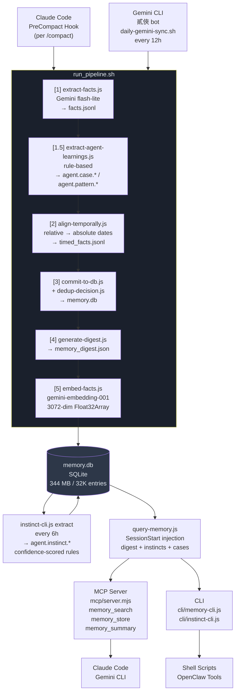

# Memory Consolidation System — Design Document

#system-design #memory-consolidation #architecture #2026-04-05

---

## 1. Overview

A persistent, cross-session memory system for AI agents (Claude Code, Gemini CLI). Extracts facts from conversation transcripts, stores them in a SQLite vector database, and injects relevant context at session start.

**Core problem solved:** AI agents lose context between sessions. This system captures learnings from every conversation and makes them available to future sessions automatically.

---

## 2. System Architecture



---

## 3. Pipeline Steps

### Step 1 — extract-facts.js
**Input:** Session JSONL transcript
**Output:** `facts.jsonl`
**Model:** Gemini 2.5-flash-lite

Extracts structured facts from conversation. Key prefixes:
- `user.*` — user identity, preferences, goals
- `project.*` — project state, decisions
- `config.*` — system configuration
- `agent.case.*` — error→success pairs (JSON: `{problem, solution, outcome}`)
- `agent.pattern.*` — reusable workflow patterns

### Step 1.5 — extract-agent-learnings.js
**Input:** Session JSONL
**Output:** Writes directly to memory.db
**Purpose:** Rule-based extraction of behavioral patterns (no LLM cost)

Identifies:
- Error→success sequences → `agent.case.<type>.<id>`
- High-frequency tools (≥5 uses) → `agent.pattern.frequent_<tool>`
- Repeated tool sequences (≥3x) → `agent.pattern.sequence_<id>`
- Successful workflows (streak ≥5) → `agent.pattern.workflow_<id>`

### Step 2 — align-temporally.js
**Input:** `facts.jsonl`
**Output:** `timed_facts.jsonl`

Resolves relative timestamps ("yesterday", "last week") to absolute ISO dates.

### Step 3 — commit-to-db.js + dedup-decision.js
**Input:** `timed_facts.jsonl`
**Output:** `memory.db`

Dedup pipeline per fact:
1. Vector similarity pre-filter (cosine > 0.85 against existing entries)
2. LLM judgment: `skip` (duplicate) / `merge` (update value) / `create` (new entry)

Mergeable types: `fact`, `pref`, `entity`
Immutable types: `event`, `agent.case`

### Step 4 — generate-digest.js
**Input:** `memory.db`
**Output:** `memory_digest.json`

Generates a hierarchical summary of all facts grouped by category for fast SessionStart injection (avoids full DB scan at startup).

### Step 5 — embed-facts.js
**Input:** `memory.db` (rows with `embedding IS NULL`)
**Output:** Float32Array BLOBs stored in `memory.db`
**Model:** `gemini-embedding-001` (3072 dimensions)

Auth priority:
1. `GOOGLE_API_KEY` / `GOOGLE_API_KEY2` (faster, has RPM limit)
2. Vertex AI via `gcloud auth print-access-token` (no limit, fallback on 429)

Incremental — only processes rows missing embeddings.

---

## 4. Instinct Extraction

Separate pipeline running every 6h via cron:

```
agent.case.* + agent.pattern.*
    ↓ (instinct-cli.js extract)
agent.instinct.<domain>.<id>
    ↓ (SessionStart injection)
Claude session context
```

**Domains:** `error`, `workflow`, `tool`, `coding`, `testing`

**Confidence scoring:**
| Evidence count | Confidence |
|----------------|------------|
| ≥10 | 0.9 |
| ≥7 | 0.8 |
| ≥5 | 0.7 |
| ≥3 | 0.6 |
| ≥2 | 0.5 |
| 1 | 0.4 |

Only instincts with confidence ≥ 0.6 are injected at SessionStart.

**Instinct format (example):**
```
[tool] when edit functionality is needed → Prefer using Edit tool (80%)
[error] when test failure encountered → Use Bash to resolve (90%)
```

---

## 5. Database Schema

```sql
CREATE TABLE memories (
    key           TEXT PRIMARY KEY,
    value         TEXT NOT NULL,
    source        TEXT,
    start_time    TEXT,          -- ISO 8601
    end_time      TEXT,          -- NULL = active
    access_count  INTEGER DEFAULT 0,
    last_accessed TEXT,
    embedding     BLOB           -- Float32Array, 3072-dim
);
```

**Current stats (2026-04-05):**
| Metric | Value |
|--------|-------|
| Total entries | 32,389 |
| Embedding coverage | 27,759 / 32,389 (85.7%) |
| DB size | 344.8 MB |
| Instincts | 4,398 |
| Agent cases | 13,823 |
| Agent patterns | 1,288 |

**Key prefix distribution:**
| Prefix | Count | % |
|--------|-------|---|
| agent.* | ~19,500 | 60% |
| claude.* | ~4,900 | 15% |
| task.* | ~2,700 | 8% |
| entity.* | ~960 | 3% |
| config.* | ~700 | 2% |
| project.* | ~700 | 2% |
| Other | ~2,800 | 9% |

---

## 6. Access Interfaces

### MCP Server (`mcp/server.mjs`)
Used by: Claude Code, Gemini CLI (via MCP protocol)

| Tool | Input | Output |
|------|-------|--------|
| `memory_summary` | — | Hierarchical category overview |
| `memory_search` | prefix / query / keys | Matching entries (hybrid search) |
| `memory_store` | key, value | Confirmation |

**Hybrid search** combines:
- Exact key match
- Prefix scan
- Semantic vector search (cosine similarity on embeddings)

### CLI (`cli/memory-cli.js`)
Used by: Shell scripts, OpenClaw tools

```bash
node cli/memory-cli.js store <key> <value>
node cli/memory-cli.js search --prefix project.
node cli/memory-cli.js search --query "polybot RAM"
node cli/memory-cli.js search --semantic "trading strategy"
node cli/memory-cli.js summary
```

### Instinct CLI (`cli/instinct-cli.js`)
```bash
node cli/instinct-cli.js list                    # All instincts
node cli/instinct-cli.js list --domain error     # Filter by domain
node cli/instinct-cli.js show agent.instinct.x   # Details
node cli/instinct-cli.js extract --store         # Generate new instincts
node cli/instinct-cli.js stats                   # Statistics
```

### SessionStart Injection (`src/query-memory.js`)
Called by Claude Code hook at session start. Injects:
1. Memory digest (top facts by category)
2. Top error entries
3. 5 most recent agent cases/patterns
4. Instincts (confidence ≥ 0.6)

---

## 7. Code Structure

```
memory-consolidation/
├── run_pipeline.sh              # Main pipeline runner (steps 1-5)
├── memory.db                    # SQLite database (not in git)
├── memory_digest.json           # Cached digest (regenerated each run)
├── digest-config.json           # Category/dedup config
├── package.json
│
├── src/
│   ├── 1-extract-facts.js       # LLM fact extraction from JSONL
│   ├── 2-align-temporally.js    # Relative → absolute timestamp resolution
│   ├── 3-commit-to-db.js        # DB write with dedup logic
│   ├── 4-generate-digest.js     # Hierarchical summary → memory_digest.json
│   ├── 5-embed-facts.js         # Vector embedding backfill
│   │
│   ├── extract-agent-learnings.js  # Rule-based case/pattern extraction
│   ├── extract-instincts.js        # Instinct aggregation from cases/patterns
│   ├── extract-checkpoint.js       # Session checkpoint extraction
│   ├── extract-errors.js           # Error pattern extraction
│   │
│   ├── embed.js                    # Embedding API (Gemini + Vertex AI fallback)
│   ├── hybrid-search.js            # Keyword + semantic search
│   ├── dedup-decision.js           # LLM dedup judgment
│   ├── query-memory.js             # SessionStart context assembly
│   ├── synthesize-skills.js        # Skill synthesis from memory
│   ├── noise-filter.js             # Low-value fact filtering
│   ├── verdict.js                  # Dedup verdict application
│   ├── category-map.js             # Prefix → category mapping
│   │
│   ├── convert-gemini-sessions.js  # Gemini CLI → JSONL conversion
│   ├── gemini-session-extract.js   # Gemini session parsing
│   ├── gemini-session-extract-worker.js
│   ├── gemini-precompress-snapshot.js
│   │
│   ├── daily-gemini-sync.sh        # Cron entry: Gemini session sync
│   ├── analyze-observations.js     # Observation analysis
│   ├── generate-observation-report.js
│   ├── archive-daily-logs.js
│   ├── check_db.js                 # DB health check
│   └── facts.jsonl / timed_facts.jsonl  # Intermediate (gitignored)
│
├── cli/
│   ├── memory-cli.js               # Shell CLI interface
│   └── instinct-cli.js             # Instinct management CLI
│
├── mcp/
│   ├── server.mjs                  # MCP server (Claude/Gemini integration)
│   └── package.json
│
├── staging/                        # PreCompact JSON snapshots (gitignored)
├── logs/                           # Pipeline logs (gitignored)
└── docs/
    └── superpowers/specs/          # Design documents
```

---

## 8. Cron Schedule

| Time (Taipei) | Command | Purpose |
|---------------|---------|---------|
| Every 12h | `daily-gemini-sync.sh` | Ingest Gemini CLI sessions |
| Every 6h (30min) | `instinct-cli.js extract --store` | Generate new instincts |
| Sunday 3:00 AM | Agent entry pruning | Delete old cases/patterns |

**Agent entry pruning rules:**
- `agent.case.*` older than 30 days + `access_count < 2` → delete
- `agent.pattern.*` older than 60 days + `access_count < 2` → delete

**Claude Code hooks:**
- `PreCompact` → `pre-compact-extract.js` → runs steps 1, 1.5, 3 before each `/compact`

---

## 9. Removed Features (2026-04-05)

| Feature | Reason |
|---------|--------|
| Step 6: generate-daily-log.js | No value — logs not read by anyone |
| Step 7: consolidate-weekly.js | No value — topics not used in practice |
| Step 8: update-rolling-topics.js | Depends on step 7, same reason |
| evolve-instructions.js + cron | Redundant with instinct-cli; file grew to 65K lines with no pruning |

---

## 10. Configuration (`digest-config.json`)

```json
{
  "shown_categories": ["user", "project", "task", "system", "config", "model", "telegram", "agent", "entity", "event"],
  "pinned_keys": ["user.name", "user.language"],
  "min_count_for_l0": 5,
  "max_categories_in_l0": 15,
  "type_mappings": {
    "fact":      ["user.", "project.", "system.", "task."],
    "pref":      ["pref.", "config.", "preference."],
    "entity":    ["entity."],
    "event":     ["event."],
    "agent":     ["agent.case.", "agent.pattern."],
    "inferred":  ["inferred."],
    "error":     ["error.", "correction."]
  },
  "mergeable_types": ["fact", "pref", "entity"],
  "immutable_types": ["event", "agent.case"],
  "dedup": {
    "enabled": true,
    "similarity_threshold": 0.85,
    "max_candidates": 5,
    "model": "gemini-2.5-flash-lite"
  }
}
```

---

## 11. Maintenance

### DB Health Check
```bash
cd ~/.openclaw/workspace/skills/memory-consolidation
node -e "
const db = require('better-sqlite3')('memory.db');
const total = db.prepare('SELECT COUNT(*) as c FROM memories').get().c;
const emb = db.prepare('SELECT COUNT(*) as c FROM memories WHERE embedding IS NOT NULL').get().c;
const inst = db.prepare(\"SELECT COUNT(*) as c FROM memories WHERE key LIKE 'agent.instinct%'\").get().c;
console.log('total:', total, '| embedded:', emb, '('+(emb/total*100).toFixed(1)+'%)');
console.log('instincts:', inst);
console.log('DB size:', (require('fs').statSync('memory.db').size/1024/1024).toFixed(1)+'MB');
"
```

### VACUUM (after large pruning)
```bash
node -e "require('better-sqlite3')('memory.db').exec('VACUUM')"
```

### Backfill missing embeddings
```bash
source ~/.openclaw/workspace/tools/load-secrets.sh
node src/5-embed-facts.js
```

### Force instinct extraction
```bash
node cli/instinct-cli.js extract --store
```

### Manual Gemini sync
```bash
bash src/daily-gemini-sync.sh
```
